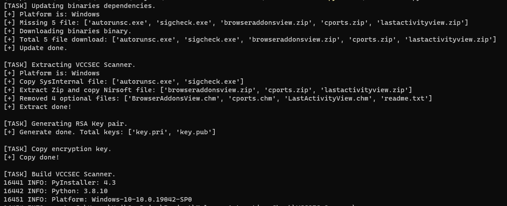
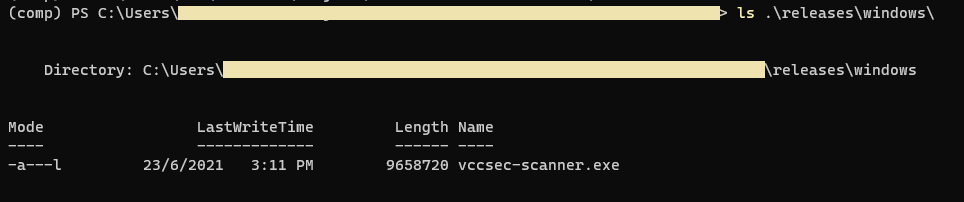

# VCCSEC Scanner

A Tool for Malware checking in server, client computer. It collecting security data, standardized output and then send to the Central Management System (SIEM/Log Management).

## 1. Scanner capability

- Scanning based on modules: info, autoruns, process, network, eventlogs, browseraddon, lastactivity, filesystem,.v.v..
- Simply and easy to use
- Cross-platform support: Windows, Linux, macOS
- Encryption scan results before sending them to the Central Management System
- and more..!


## 2. Setting up environment

- Download and install Python 3: https://www.python.org/downloads. Requires Python version 3.6 or higher, to verify:

  ```bash
  $ python3 -V
  Python 3.8.10

  $ pip3 -V
  pip 21.1.2 from <Your-Python-Installed-Location>\lib\site-packages\pip (python 3.8)
  ```

- Create virtual python environment:

  ```bash
  $ pip3 install virtualenv

  # Windows
  $ mkdir my-project & cd my-project
  $ virtualenv -p c:\path\to\python.exe venv

  # Linux or MacOSX
  $ mkdir my-project && cd my-project
  $ virtualenv -p /path/to/python3 venv
  ```

- Active virtual environment:

  ```bash
  # Windows:
  $ venv\Scripts\activate

  # Linux or MacOS:
  $ source venv/bin/activate
  ```

- Download or clone source code:

  ```bash
  $ git clone https://github.com/hailehong95/vccsec-scanner.git
  ```

- Install dependencies packages:

  ```bash
  (venv) $ cd vccsec-scanner
  (venv) $ pip install -r requirements.txt
  ```

## 3. Building VCCSEC Scanner

- VCCSEC Utility: It's also known as Builder/Maker, used to packing **vccsec scanner** as a single executable, convenient for distribution to users when scanning without install any dependencies.

  ```bash
  (venv) $ python vccsec-util.py
  Usage: vccsec-util.py [OPTIONS] COMMAND [ARGS]...

    A CLI Utility for VCCSEC Scanner

  Options:
    --help  Show this message and exit.

  Commands:
    build    Build VCCSEC Scanner
    clean    Clean all temporary working files
    keygen   RSA keys Generator
    make     Create VCCSEC Scanner bundle
    version  Show Utility version
  ```

- Using VCCSEC Utility to build vccsec scanner

  ```bash
  (venv) $ python vccsec-util.py build
  ```

- Building process logs:

  

- All done!

  

## 4. Todo

- Add user input form: id, name, group (maybe)
- Code implemented but not yet called:
  + Encrytion result
  + Send result to object storage, eg: Amazon S3, MinIO, Ceph
- Send directly to SIEM/Log Manager (maybe)

## 5. Systems that have been tested

- Microsoft Windows: 7, 8/8.1, 10, 2012, 2016, 2019
